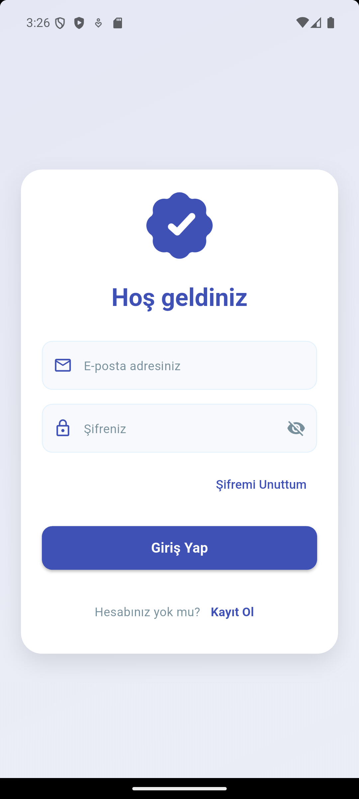
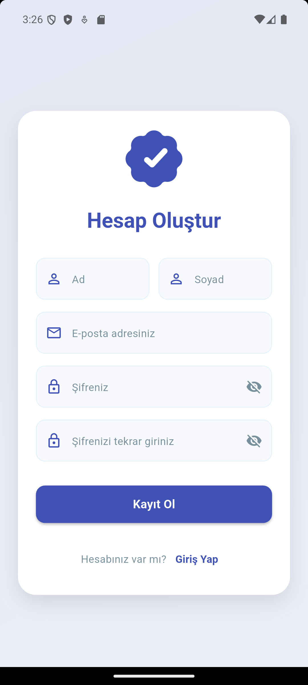
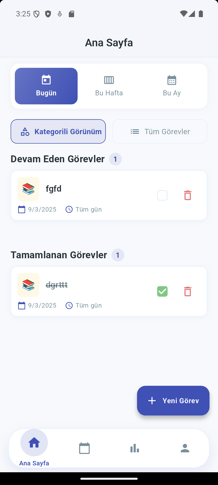
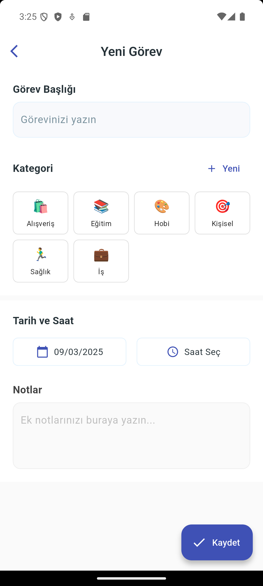
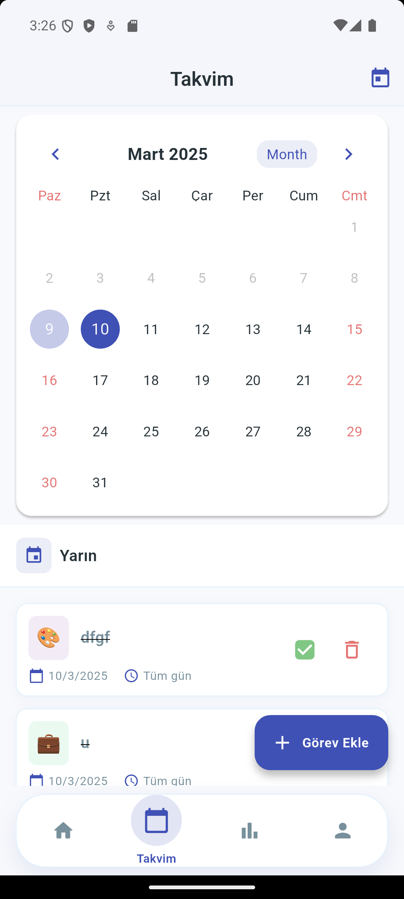
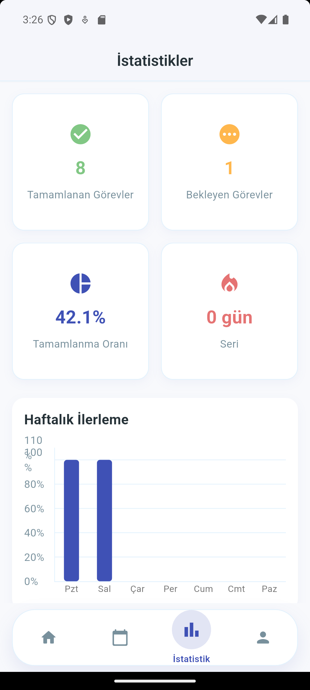
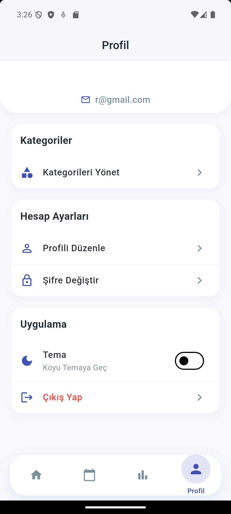

# 📌 Daily Planner - Görev Yönetimi Uygulaması

**Daily Planner**, kullanıcıların günlük işlerini organize etmelerini sağlayan bir **görev yönetimi uygulamasıdır**.\
MVVM mimarisiyle geliştirilmiş olup, **Riverpod state management** kullanılmıştır.

## 🔍 Uygulama Özellikleri 

### 📝 Görev Yönetimi
- **Görev Oluşturma:** Başlık, açıklama, kategori, tarih ve öncelik belirleyerek yeni görevler ekleyin
- **Görev Düzenleme:** Mevcut görevleri düzenleyin ve güncelleyin
- **Görev Tamamlama:** Tamamlanan görevleri işaretleyin
- **Görev Silme:** Artık ihtiyaç duymadığınız görevleri silin

### 🛢️ Kategori Yönetimi
- **Özelleştirilebilir Kategoriler:** Kendi renkli ve emojili kategorilerinizi oluşturun
- **Kategori Düzenleme:** Mevcut kategorileri düzenleyin
- **Kategori İstatistikleri:** Her kategorideki görev tamamlama oranlarını görüntüleyin

### 📊 İstatistikler ve Raporlar
- **Günlük İstatistikler:** Günlük tamamlanan görevlerin özeti
- **Haftalık Trend:** Haftalık performansınızı grafiklerle takip edin

---

## 🖼️ Ekran Görüntüleri

<div style="display: flex; flex-wrap: wrap; gap: 10px; justify-content: center">
 
  
  
  
  
  

  

  
 
  
 
  

</div>

---

## 🛠 Kullanılan Teknolojiler

| Teknoloji      | Açıklama                      |
| -------------- | ----------------------------- |
| **Flutter**    | Mobil UI geliştirme           |
| **Dart**       | Flutter için programlama dili |
| **Node.js**    | Backend servisi               |
| **Express.js** | API geliştirme                |
| **MongoDB**    | Veritabanı                    |
| **Riverpod**   | State Management              |
| **Dio**        | HTTP istekleri için           |

---
## 📡 API Dokümantasyonu

Uygulama aşağıdaki API endpoint'lerini kullanır:

### Auth Endpoints

| Endpoint | Metod | Açıklama | Parametre | Header |
|----------|-------|----------|-----------|--------|
| `/auth/login` | POST | Kullanıcı girişi | email, password | - |
| `/auth/register` | POST | Yeni kullanıcı kaydı | username, email, password | - |
| `/auth/user` | GET | Kullanıcı bilgilerini getir | - | Authorization: Bearer {token} |
| `/auth/profile` | PUT | Kullanıcı profilini güncelle | name, email | Authorization: Bearer {token} |
| `/auth/change-password` | POST | Kullanıcı şifresini değiştir | currentPassword, newPassword | Authorization: Bearer {token} |

### Todo Endpoints

| Endpoint | Metod | Açıklama | Parametre | Header |
|----------|-------|----------|-----------|--------|
| `/todos` | GET | Tüm görevleri getir | category (opsiyonel) | Authorization: Bearer {token} |
| `/todos/by-date` | GET | Belirli tarihteki görevleri getir | date (ISO formatında tarih) | Authorization: Bearer {token} |
| `/todos/` | POST | Yeni görev ekle | title, description, date, completed, categoryId, color | Authorization: Bearer {token} |
| `/todos/:id` | PUT | Görevi güncelle | title, description, date, completed, categoryId, color | Authorization: Bearer {token} |
| `/todos/:id` | DELETE | Görevi sil | id (path parametre) | Authorization: Bearer {token} |

### Category Endpoints

| Endpoint | Metod | Açıklama | Parametre | Header |
|----------|-------|----------|-----------|--------|
| `/categories/:userId` | GET | Kullanıcının kategorilerini getir | userId (path parametre) | Authorization: Bearer {token} |
| `/categories/` | POST | Yeni kategori ekle | name, color, icon, userId | Authorization: Bearer {token} |
| `/categories/:categoryId` | PUT | Kategoriyi güncelle | name, color, icon | Authorization: Bearer {token} |
| `/categories/:categoryId` | DELETE | Kategoriyi sil | categoryId (path parametre) | Authorization: Bearer {token} |

### Statistics Endpoints

| Endpoint | Metod | Açıklama | Parametre | Header |
|----------|-------|----------|-----------|--------|
| `/statistics` | GET | Görev istatistiklerini getir | - | Authorization: Bearer {token} |

## 📺 Kullanılan Paketler

```yaml
dependencies:
  cupertino_icons: ^1.0.6
  flutter_riverpod: ^2.6.1
  dio: ^5.8.0+1
  shared_preferences: ^2.5.1
  table_calendar: 3.1.3
  intl: ^0.19.0
  fl_chart: ^0.70.2
  http: ^1.3.0
  flutter_dotenv: ^5.2.1
  flutter_tts: ^4.2.2
  permission_handler: ^11.3.1
```

---

## 📚 Proje Mimarisi

```bash
lib/
│── core/                  # Temel yapı, navigasyon, tema
│   ├── navigation/
│   │   └── routes.dart    # Uygulama yönlendirmeleri
│   ├── theme/
│   │   ├── app_theme.dart # Temalar
│   │   └── colors.dart    # Renk tanımlamaları
│
│── data/                  # Veri katmanı
│   ├── models/            # Veri modelleri
│   │   ├── category_model.dart
│   │   ├── task_statistics.dart
│   │   ├── todo_model.dart
│   │   └── user_model.dart
│   ├── repositories/      # Servis ve veri yönetimi
│       ├── auth_service.dart
│       ├── category_service.dart
│       ├── statistic_service.dart
│       └── todo_service.dart
│
│── domain/                # İş mantığı katmanı
│   ├── presentation/      # Sunum katmanı
│   │   ├── providers/     # State Management 
│   │   │   ├── providers.dart
│   │   │   └── theme_providers.dart
│   │   ├── viewmodels/    # ViewModel'ler
│   │   │   ├── auth_viewmodel.dart
│   │   │   ├── calendar_viewmodel.dart
│   │   │   ├── category_viewmodel.dart
│   │   │   ├── statistics_viewmodel.dart
│   │   │   └── todo_viewmodel.dart
│   └── views/             # Kullanıcı arayüzü
│       ├── auth/
│       ├── home/
│       ├── onboarding/
│       └── profile/
│
└── main.dart              # Uygulama giriş noktasi
```

---

## 🚀 Kurulum ve Çalıştırma

### **1️⃣ Projeyi Klonlayın**

```bash
git clone https://github.com/rumeysa111/daily_planner_frontend.git

```

### **2️⃣ Bağımlılıkları Yükleyin**

```bash
flutter pub get
```

### **3️⃣ Uygulamayı Çalıştırın**

```bash
flutter run
```

---

## 🎯 Katkıda Bulunma

1. **Fork yapın** (Sağ üst köşedeki Fork butonuna basın).
2. Yeni bir **özellik dalı** oluşturun (`git checkout -b feature/amazing-feature`).
3. Değişikliklerinizi commit edin (`git commit -m 'Yeni özellik eklendi'`).
4. **Dalınıza push edin** (`git push origin feature/amazing-feature`).
5. **Pull Request açın** 🎉

---
## 🔒 Güvenlik ve Gizlilik

- Kullanıcı kimlik doğrulaması için JWT (JSON Web Token) kullanılmaktadır
- Tüm şifreler hashlenmiş şekilde saklanır
- Veriler MongoDB veritabanında güvenle depolanır


🔗 **Backend Repository:**  
[Daily Planner - Backend](https://github.com/rumeysa111/daily_planner_backend)


## 📝 Lisans

*MIT License*

---

## 📩 İletisim

**Rumeysa Semiz** - [GitHub](https://github.com/rumeysa111)

📌 **Proje Linki:** [Daily Planner - GitHub](https://github.com/rumeysa111/daily_planner_frontend)

```

```
